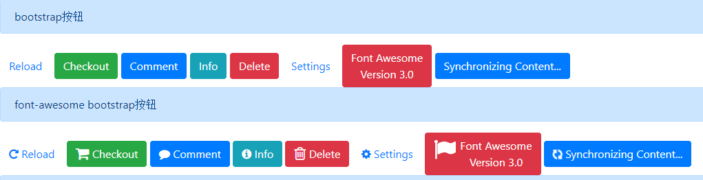

# CSS  Font Awesome快速入门  ------ chapter-03-03

		概念
		如何使用
		快速入门


## 概念

Font Awesome只为Bootstrap设计的完美图标和字体

效果如图所示


一组使用bootstrap，另外一组使用font-awesome

代码如下：

```
<a class="btn" href="#" >Reload</a>

<a class="btn" href="#"> <i class="icon-repeat"></i> Reload</a>
```


官网地址:  http://www.bootcss.com/p/font-awesome/#

## 如何使用

下载font-awesome

将css和font目录拷贝到 statics目录下

引入css
```
<head>
	<link rel="stylesheet" href="statics/css/font-awesome.min.css">
</head>
```

## 快速入门

实例如下

```
<!doctype html>
<html lang="en">
<head>
    <!-- Required meta tags -->
    <meta charset="utf-8">
    <meta name="viewport" content="width=device-width, initial-scale=1, shrink-to-fit=no">

    <!-- Bootstrap CSS -->
    <link rel="stylesheet" href="https://stackpath.bootstrapcdn.com/bootstrap/4.1.3/css/bootstrap.min.css"
          integrity="sha384-MCw98/SFnGE8fJT3GXwEOngsV7Zt27NXFoaoApmYm81iuXoPkFOJwJ8ERdknLPMO" crossorigin="anonymous">
    
    <!-- font-awesome CSS -->
    <link rel="stylesheet" href="statics/css/font-awesome.min.css">

    <title>Hello, world!</title>
</head>
<body>
<h1>Hello, world!</h1>
<div class="alert alert-primary" role="alert">
    bootstrap按钮
</div>
<a class="btn" href="#" >Reload</a>
<a class="btn btn-success" href="#">Checkout</a>
<a class="btn btn-large btn-primary" href="#">Comment</a>
<a class="btn btn-small btn-info" href="#">Info</a>
<a class="btn btn-danger" href="#">Delete</a>
<a class="btn btn-small" href="#">Settings</a>
<a class="btn btn-large btn-danger" href="#">Font Awesome<br>Version 3.0</a>
<a class="btn btn-primary" href="#">Synchronizing Content...</a>
<div class="alert alert-primary" role="alert">
    font-awesome bootstrap按钮
</div>
<a class="btn" href="#">
    <i class="icon-repeat"></i> Reload</a>
<a class="btn btn-success" href="#">
    <i class="icon-shopping-cart icon-large"></i> Checkout</a>
<a class="btn btn-large btn-primary" href="#">
    <i class="icon-comment"></i> Comment</a>
<a class="btn btn-small btn-info" href="#">
    <i class="icon-info-sign"></i> Info</a>
<a class="btn btn-danger" href="#">
    <i class="icon-trash icon-large"></i> Delete</a>
<a class="btn btn-small" href="#">
    <i class="icon-cog"></i> Settings</a>
<a class="btn btn-large btn-danger" href="#">
    <i class="icon-flag icon-2x pull-left"></i>Font Awesome<br>Version 3.0</a>
<a class="btn btn-primary" href="#">
    <i class="icon-refresh icon-spin"></i> Synchronizing Content...</a>
<div class="alert alert-primary" role="alert">
    按钮组
</div>
<div class="btn-group">
    <a class="btn" href="#"><i class="icon-align-left"></i></a>
    <a class="btn" href="#"><i class="icon-align-center"></i></a>
    <a class="btn" href="#"><i class="icon-align-right"></i></a>
    <a class="btn" href="#"><i class="icon-align-justify"></i></a>
</div>

</body>
</html>
```