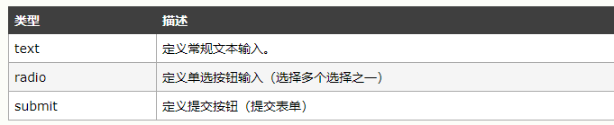
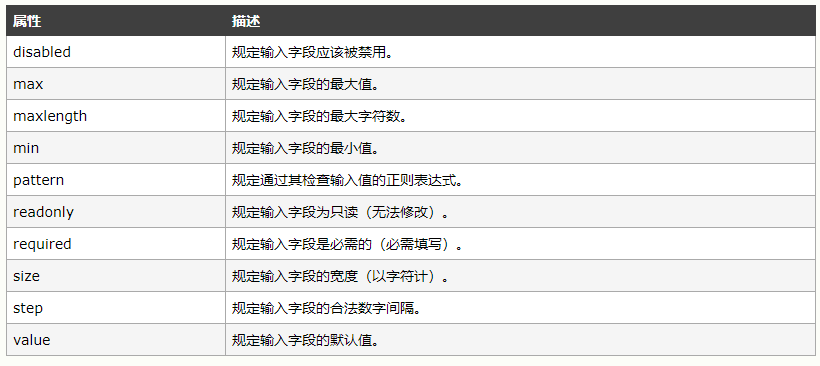
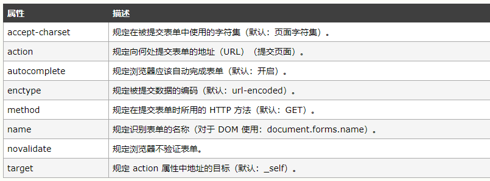

# HTML HTML-Form   ------ chapter-01-02

		常用表单元素
			input元素
			button元素
			select元素
			datalist元素
		表单属性
		表单元素属性


## 常用表单元素

HTML 表单用于收集用户输入。

### input元素

<input> 元素是最重要的表单元素。

<input> 元素有很多形态，根据不同的 type 属性



```
<!DOCTYPE html>
<html>
<body>

<form action="/demo/demo_form.asp" method="GET">
First name:<br>
<input type="text" name="firstname" value="Mickey">
<br>
Last name:<br>
<input type="text" name="lastname" value="Mouse">
<br>
<input type="radio" name="sex" value="male" checked>Male
<input type="radio" name="sex" value="female">Female
<br><br>
<input type="submit" value="Submit">
</form> 

</body>
</html>

```

点“提交”时，只有存在 **name**属性input元数据才会被提交


HTML5 输入类型
HTML5 增加了多个新的输入类型：

* color
* date
* datetime
* datetime-local
* email
* month
* number
* range
* search
* tel
* time
* url
* week

```

<input type="number" name="quantity" min="1" max="5">
<input type="color" name="color">color</input>
<input type="date" name="date">date</input>
<input type="datetime" name="datetime">datetime</input>
<input type="time" name="time">time</input>
<input type="email" name="email">email</input>
<input type="tel" name="tel">tel</input>
<input type="url" name="url">url</input>
<input type="search" name="search">search</input>
<input type="range" name="range">range</input>
```



```
<form>
  <input type="number" name="points" min="0" max="100" step="10" value="30">
  Enter a date before 1980-01-01:
  <input type="date" name="bday" max="1979-12-31"><br>
  Enter a date after 2000-01-01:
  <input type="date" name="bday" min="2000-01-02"><br>
</form>
```

### button元素

```
<button type="button" onclick="alert('Hello World!')">Click Me!</button>
```

### select元素

```
<select name="cars">
<option value="volvo">Volvo</option>
<option value="saab">Saab</option>
</select>
```

### datalist元素
```
<input list="browsers" name="browser">
<datalist id="browsers">
  <option value="Internet Explorer">
  <option value="Firefox">
  <option value="Chrome">
  <option value="Opera">
  <option value="Safari">
</datalist>
```

## 表单属性

更多表单属性如下
```
<form action="action_page.php" method="GET" target="_blank" accept-charset="UTF-8"
enctype="application/x-www-form-urlencoded" autocomplete="off" novalidate>
.
form elements
 .
</form> 
```



autocomplete 属性规定表单或输入字段是否应该自动完成。

您可以把表单的 autocomplete 设置为 on，同时把特定的输入字段设置为 off，反之亦然
```
<form action="action_page.php" autocomplete="on">
   First name:<input type="text" name="fname"><br>
   Last name: <input type="text" name="lname"><br>
   E-mail: <input type="email" name="email" autocomplete="off"><br>
   <input type="submit">
</form> 
```

## 表单元素属性

value 属性: 规定输入字段的初始值

readonly 属性: 规定输入字段为只读

disabled 属性: 规定输入字段是禁用的及不可点击的

size 属性: 规定输入字段的尺寸（以字符计）

autofocus 属性: 规定当页面加载时 <input> 元素应该自动获得焦点

placeholder 属性: 规定用以描述输入字段预期值的提示

required 属性: 规定在提交表单之前必须填写输入字段


HTML5 属性
HTML5 为 <input> 增加了如下属性：
```
autocomplete
autofocus
form
formaction
formenctype
formmethod
formnovalidate
formtarget
height 和 width
list
min 和 max
multiple
pattern (regexp)
placeholder
required
step
```
并为 <form> 增加如需属性
```
autocomplete
novalidate
```