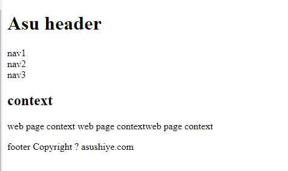
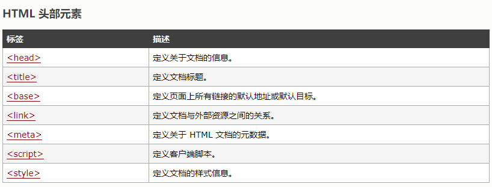
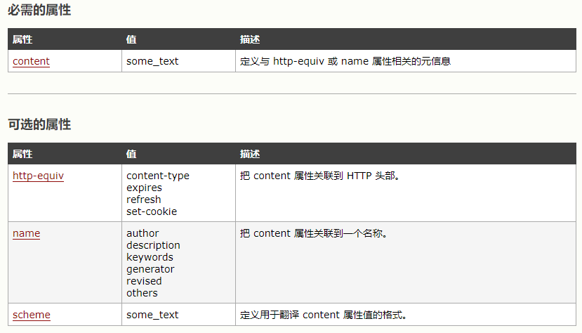

# HTML    ------ chapter-01-01

		Web页面概念
		HTML文档
		HTML标签
			常用标签
			列表标签
			表格标签
			布局标签
			头标签
			框架
		HTML注释
		JavaScript引用
		CSS引用
		

## Web页面概念

Web页面由页面文档，一般为HTML，CSS及JS组成，Html相当文档结构，起到布局作用，JS负责交互， CSS负责页面美化。

如何帮助浏览器正确地显示网页呢， Web文档使用<!DOCTYPE> 指定文档类型

<!DOCTYPE html> 表示HTML文档

## HTML文档

HTML 指的是超文本标记语言 (Hyper Text Markup Language)，由HTML 标签组成，是用来描述网页的一种语言。

HTML 文档是由 HTML标签(元素)定义的。

HTML已经定义很多元素，每个元素定义很属性。

很多属性用于定义样式和美观，这些属性不需要编写，交给CSS来完成。

下面主要介绍HTML标签，JS引用，CSS引用


```
<html>
<body>
    <h1>标题</h1>
    <p>段落</p>
</body>
</html>
```

例子解释
```
<html> 与 </html> 之间的文本描述网页
<body> 与 </body> 之间的文本是可见的页面内容
<h1> 与 </h1> 之间的文本被显示为标题
<p> 与 </p> 之间的文本被显示为段落
```

 下面我们了解更多html标签

## HTML标签

### 常用标签

|HTML标签|符合|实例|
|-|-|-|
|标题|h1 - h6|实例h1This is a heading/h1|
|分隔线|hr|hr/|
|段落|p|实例p锻炼p/|
|链接|a|a href="url" target="_blank"Link text/a|
|图片|img|img src="boat.gif" alt="Big Boat" 与背景图区别，其中背景图放在标签属性 background="/i/eg_background.jpg" |
|块级元素|div|它是可用于组合其他 HTML 元素的容器|
|文本元素|span|可用作文本的容器,为CSS提供设置部分文本样式|


### 列表标签

无序列表
```
<ul>
<li>Coffee</li>
<li>Milk</li>
</ul>
```

有序列表
```
<ol>
<li>Coffee</li>
<li>Milk</li>
</ol>
```


### 表格标签

```
<table border="1">
<tr>
<th>Heading</th>
<th>Another Heading</th>
</tr>
<tr>
<td>row 1, cell 1</td>
<td>row 1, cell 2</td>
</tr>
<tr>
<td>row 2, cell 1</td>
<td>row 2, cell 2</td>
</tr>
</table>
```
```
<th> 定义表头
<tr> 定义行
<td> 定义单元格
```

### 布局标签

```
<!DOCTYPE html>
<html>
<head></head>

<body>
<div id="header">
<h1>Asu header</h1>
</div>

<div id="nav">
nav1<br>
nav2<br>
nav3<br>
</div>


<div id="section">
<h2>context</h2>
<p>web page context web page contextweb page context</p>
</div>


<div id="footer">
footer Copyright ? asushiye.com
</div>

</body>
</html>

```



|HTML标签|描述|
|-|-|
|header|定义文档或节的页眉|
|nav|定义导航链接的容器|
|section|定义文档中的节|
|article|定义独立的自包含文章|
|aside|定义内容之外的内容（比如侧栏）|
|footer|定义文档或节的页脚|
|details|定义额外的细节|
|summary|定义 details 元素的标题|


### 头标签



```
<head>
  <base href="http://www.w3school.com.cn/i/" />
  <base target="_blank" />

  <meta charset="UTF-8">
  <meta name="Generator" content="EditPlus®">
  <meta name="Author" content="">
  <meta name="Keywords" content="">
  <meta name="Description" content="">

  <link rel="stylesheet" type="text/css" href="mystyle.css" />

</head>
```
base标签，第一个表示页面URL地址，基本地址，后面的图片，链接，CSS及JS引用填写相当路径就行

一定要放最前面

实例如下

```
<html>
<head>
<base href="http://www.w3school.com.cn/i/" />
<base target="_blank" />
</head>

<body>
<br />
<p>"http://www.w3school.com.cn/i/eg_smile.gif"</p>
<br /><br />
<p><a href="http://www.w3school.com.cn">W3School</a></p>

</body>
</html>
```


meta标签，<meta> 元素可提供有关页面的元信息（meta-information）



**keywords** 表示可以被搜索引擎使用的关键字时
**http-equiv** 属性为名称/值对提供了名称。并指示服务器在发送实际的文档之前先在要传送给浏览器的 MIME 文档头部包含名称/值对。
**content** 属性提供了名称/值对中的值，content 属性始终要和 name 属性或 http-equiv 属性一起使用。
```
<meta http-equiv="charset" content="iso-8859-1">
<meta http-equiv="expires" content="31 Dec 2008">

则HTTP请求报文

content-type: text/html
charset:iso-8859-1
expires:31 Dec 2008

```


### 框架

先了解框架，后面了解内联框架

#### 框架
用于将网页分割成多个部分来显示不同内容

```
垂直方向

<html>

<frameset cols="25%,50%,25%">

  <frame src="/example/html/frame_a.html">
  <frame src="/example/html/frame_b.html">
  <frame src="/example/html/frame_c.html">

</frameset>

</html>

水平方向
<html>

<frameset rows="25%,50%,25%">

  <frame src="/example/html/frame_a.html">
  <frame src="/example/html/frame_b.html">
  <frame src="/example/html/frame_c.html">

</frameset>

</html>

```

#### 内联框架

可以在网页中显示网页

`<iframe src="demo_iframe.htm" width="200" height="200" frameborder="0"></iframe>`


## HTML注释

`<!-- 在此处写注释 -->`


## JavaScript引用

JavaScript 已经浏览器默认脚本语言，JavaScript脚本必须位于 <script> 与 </script> 标签之间。

您可以在 HTML 文档中放入不限数量的JavaScript脚本。

通常的做法是JavaScript 脚本放入 <head> 部分中，或者放在页面 <body>底部。

这样就可以把它们安置到同一处位置，不会干扰页面的内容。

### 在head引用

```
<html>
<head>
<script type="text/javascript">
function message()
{
alert("该提示框是通过 onload 事件调用的。")
}
</script>
</head>

<body onload="message()">

</body>
</html>

```

若是放在body中，建议放在最后面，这样就可以确保在body元素创建之后再执行脚本。

### 引用外部文件
```
<html>
<head>
</head>
<body>
<script src="/js/example_externaljs.js"></script>
</body>
</html>
```

## CSS引用


### Html引用样式

```
<head>
<style type="text/css">
body {background-color:yellow}
p {color:blue}
</style>
</head>
```

### 引入外部文件

```
<head>
  <base href="http://www.w3school.com.cn/i/" />
  <base target="_blank" />

  <meta charset="UTF-8">
  <meta name="Generator" content="EditPlus®">
  <meta name="Author" content="">
  <meta name="Keywords" content="">
  <meta name="Description" content="">

  <link rel="stylesheet" type="text/css" href="mystyle.css" />

</head>
```

### CSS优先级说明

所有的样式会根据下面的规则层叠于一个新的虚拟样式表中，其中数字 4 拥有最高的优先权。

1. 浏览器缺省设置
2. 外部样式表
3. 内部样式表（位于 <head> 标签内部）
4. 内联样式（在 HTML 元素内部）

后面的章节我们给几个典型案例