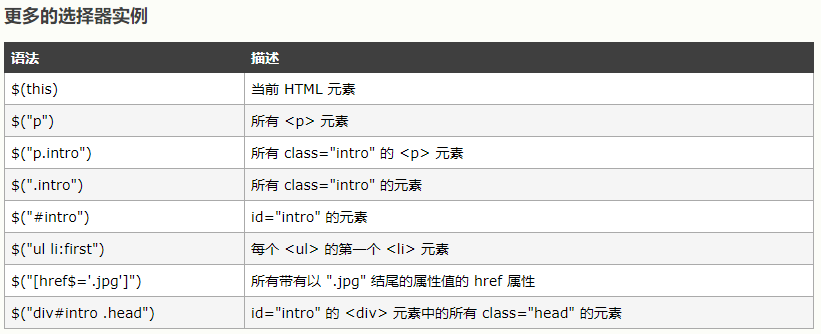
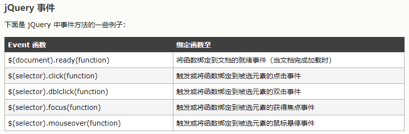

# JavaScript  jquery快速入门  ------ chapter-02-11

		jQuery概念
		如何使用
		jQuery语法
			jQuery实例
			更多选择器
			更多事件
		jquery ajax

## iQuery概念

jQuery 是一个 JavaScript 函数库

jQuery 库包含以下特性：

HTML 元素选取
HTML 元素操作
CSS 操作
HTML 事件函数
JavaScript 特效和动画
HTML DOM 遍历和修改
AJAX
Utilities


## 如何使用

### 下载jquery

共有两个版本的 jQuery 可供下载：一份是压缩过的，另一份是未压缩的（可供开发者调试或阅读使用）

官网地址: [jquery ](https://jquery.com/)

下载地址: [download](http://jquery.com/download/#Download_jQuery)

有两种方法
1. 下载到本地
2. 使用已有科技公司CDN 

已有科技公司CDN

* Microsoft CDN
* CDNJS CDN
* jsDelivr CDN
* Google CDN 

Microsoft CDN
```
https://ajax.aspnetcdn.com/ajax/jQuery/jquery-3.3.1.js
https://ajax.aspnetcdn.com/ajax/jQuery/jquery-3.3.1.min.js
https://ajax.aspnetcdn.com/ajax/jQuery/jquery-3.3.1.min.map
```
CDNJS CDN
```
https://cdnjs.cloudflare.com/ajax/libs/jquery/3.3.1/core.js
https://cdnjs.cloudflare.com/ajax/libs/jquery/3.3.1/jquery.js
https://cdnjs.cloudflare.com/ajax/libs/jquery/3.3.1/jquery.min.js
https://cdnjs.cloudflare.com/ajax/libs/jquery/3.3.1/jquery.min.map
```

提示：CDNJS是一个免费的开源项目，通过快速的CDN基础设施为开发人员组织和提供流行的前端Web开发资源，没有使用限制和费用。也可以将我们开发js发布到它的github上。

推荐使用: 使用已有科技公司CDN ,因为很多用户已经缓存了jquery。


### 向您的页面添加 jQuery 库

```
<head>
<script  src="jquery.js"></script>
</head>

或添加到

<body>
<script  src="https://ajax.aspnetcdn.com/ajax/jQuery/jquery-3.3.1.min.js"></script>
</body>

```

现代浏览器默认使用javascript， 因此 type="text/javascript"  可以省略。

## jQuery语法


 通过jQuery您可以 *选取*HTML 元素，并对它们执行 *操作*

基础语法是： **$(selector).action()**

* 美元符号定义 jQuery
* 选择符（selector）“查询”和“查找” HTML 元素
* jQuery 的 action() 执行对元素的操作

### jQuery实例

`$(this).hide()`
演示 jQuery hide() 函数，隐藏当前的 HTML 元素。
`$("#test").hide()`
演示 jQuery hide() 函数，隐藏 id="test" 的元素。
`$("p").hide()`
演示 jQuery hide() 函数，隐藏所有 <p> 元素。
`$(".test").hide()`
演示 jQuery hide() 函数，隐藏所有 class="test" 的元素。

main.html
```
<!DOCTYPE html>
<html lang="zh">
<head>
    <meta charset="UTF-8">
    <title>Title</title>
    <script src="https://ajax.aspnetcdn.com/ajax/jQuery/jquery-3.3.1.min.js"></script>
    <script type="text/javascript">
        $(document).ready(function () {
            $("button").click(function () {
                $(this).hide()
            })
        });
    </script>
</head>
<body>
<button type="button">Click me</button>
</body>
</html>
```

```
$(document).ready(function () {

--- jQuery functions go here ----

});
```

这是为了防止文档在完全加载（就绪）之前运行 jQuery 代码

当然我们可以将代码放在body的最后面，让所有html元素创建完后，在运行js

main.html
```
<!DOCTYPE html>
<html lang="zh">
<head>
    <meta charset="UTF-8">
    <title>Title</title>
</head>
<body>
<button type="button">Click me</button>

<script src="https://ajax.aspnetcdn.com/ajax/jQuery/jquery-3.3.1.min.js"></script>
<script type="text/javascript">
    $("button").click(function () {
        $(this).hide()
    });
</script>

</body>
</html>

```

当然我们也可以将jquery代码独立出来

statics/asushiye.js
```
$(function () {
    $("button").click(function () {
        $(this).hide()
    });
});
```
main.html
```
<!DOCTYPE html>
<html lang="zh">
<head>
    <meta charset="UTF-8">
    <title>Title</title>
</head>
<body>
<button type="button">Click me</button>
<script src="https://ajax.aspnetcdn.com/ajax/jQuery/jquery-3.3.1.min.js"></script>
<script src="statics/asushiye.js"></script>
</body>
</html>

```


### 更多选择器



### 更多事件


参考 [jQuery事件](http://www.w3school.com.cn/jquery/jquery_ref_events.asp)


## jquery ajax

http://localhost:8081/login
参数： userName, password 
返回值：code, msg,obj

实例如下
```
		$.ajax({
			"type": "post",
			"url": "/login",
			"data":{"userName":$userName,"password":$password},
			"success" : function(resp) {
				if (resp.code == 200) {
					window.location.href = resp.obj;
				} else {
					alert(resp.msg);
					return;
				}
			}
		});
```

该代码可以放在button下

```
$(function() {
	
	$("#submit-btn").on("click",function() {
		var $userName = $("#user-name").val();
		var $password = $("#password").val();
		
		if ($userName == "") {
			alert("用户名不能为空!");
			return;
		}
		
		if ($password == "") {
			alert("用户名不能为空!");
			return;
		}
		
		$.ajax({
			"type": "post",
			"url": "/login",
			"data":{"userName":$userName,"password":$password},
			"success" : function(resp) {
				if (resp.code == 200) {
					window.location.href = resp.obj;
				} else {
					alert(resp.msg);
					return;
				}
			}
		});
	});
	
	$(document).on("keydown",function(e) {
		if (e.keyCode == 13) {
			$("#submit-btn").trigger("click");
		}
	});
	
});
```